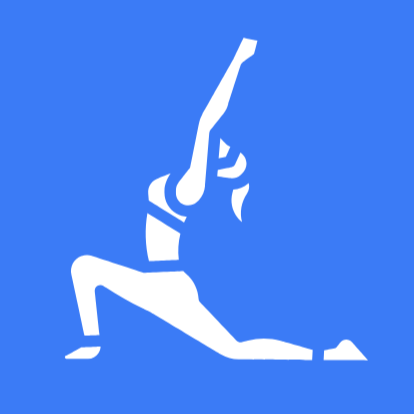
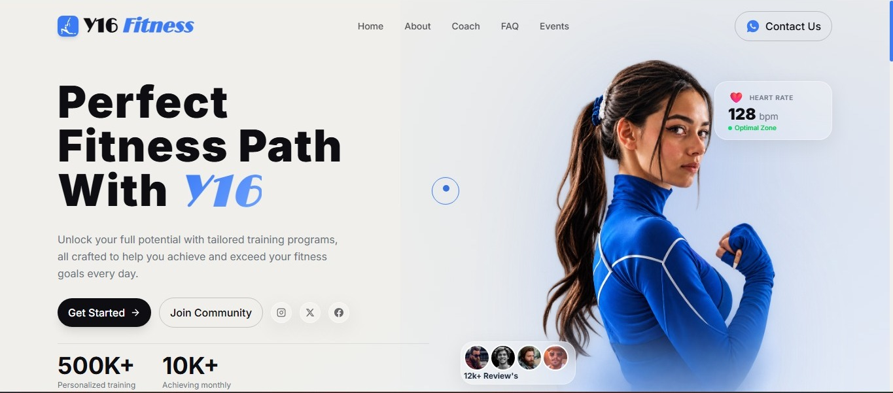

<div align="center">



# Y16 Fitness

**A modern personal fitness brand website — built to inspire motion.**

[](https://Y16Fitness.vercel.app)
[](https://react.dev)
[](https://www.framer.com/motion)
[](https://tailwindcss.com)
[](https://vitejs.dev)



</div>

---

## ✨ Overview

**Y16 Fitness** is a fully animated, responsive single-page frontend for a personal fitness brand. It features a premium UI with glassmorphism cards, a custom magnetic cursor, scroll-triggered animations, and a clean dark/light aesthetic — all built production-ready with modern React tooling.

---

## 🚀 Live Demo

👉 **[https://y16fitness.vercel.app](https://y16fitness.vercel.app)**

---

## 📸 Sections

| # | Section | Description |
|---|---------|-------------|
| 1 | **Hero** | Split layout with floating athlete, animated stat counters (500K+, 10K+), and 3 live data glass cards |
| 2 | **Health Metrics** | Interactive body-focus selector — click a category to reveal your personalized plan |
| 3 | **Nutrition** | Diet tab switcher with macro breakdown bars and an animated calorie tracker card |
| 4 | **Yoga Styles** | 3×2 dark card grid with YOGA watermark overlay, accent colors, and hover glow |
| 5 | **Events** | Dual infinite marquee banners + numbered event list with Reserve CTA |
| 6 | **Footer** | CTA band, social links, link grid, and oversized ghost brand wordmark |

---

## 🛠️ Tech Stack

| Tool | Purpose |
|------|---------|
| **React 18** | Component architecture & UI |
| **Vite 8** | Lightning-fast dev server & build tool |
| **Framer Motion 11** | All animations — scroll reveals, spring cursor, morphing, counters |
| **Tailwind CSS v4** | Utility-first responsive styling |
| **Lucide React** | Crisp SVG icon set |
| **Inter (Google Fonts)** | Clean, modern typography |

---

## 🎨 Design System

```
Background    #F0EFEB  — warm off-white
Dark          #0D0D12  — near-black for text & nav
Blue Accent   #3B7BF6  — CTAs, highlights, cursor
Blue Light    #6FA3FF  — gradient end
Muted Text    #6B7280  — body copy
Glass         rgba(255,255,255,0.22) + backdrop-blur(16px)
```

---

## ⚡ Features

- 🖱️ **Custom magnetic cursor** — dual-circle design; inner dot morphs to fill hovered buttons
- 🪟 **Glassmorphism cards** — frosted glass with hover tilt and blue glow
- 🔢 **Animated stat counters** — scroll-triggered number animation
- 🎞️ **Infinite marquee** — smooth CSS + Framer Motion seamless loop
- 📱 **Fully responsive** — 375px mobile → 1440px+ desktop
- 🔍 **SEO optimized** — Open Graph, Twitter Card, JSON-LD structured data, canonical URL
- 📦 **PWA ready** — `site.webmanifest` for "Add to Home Screen"
- ♿ **Accessible** — semantic HTML, aria labels, keyboard navigable

---

## 🏃 Getting Started

```bash
# 1. Clone the repository
git clone https://github.com/YGCodeScape/Y16-Fitness.git
cd Y16-fitness

# 2. Install dependencies
npm install

# 3. Start dev server
npm run dev
# → http://localhost:5173/

# 4. Build for production
npm run build

# 5. Preview production build locally
npm run preview
```

---

## 🔧 Customization

All content lives in one file — no digging through components:

```js
// src/data/content.js
export const HERO = { headline: [...], stats: [...], ... }
export const NUTRITION = { tabs: [...], calories: {...}, ... }
export const EVENTS = [ { title: '...', date: '...', venue: '...' }, ... ]
// etc.
```

## 📄 License

This project is open source under the [MIT License](LICENSE).

---

<div align="center">

## 💼 Want this for YOUR fitness brand?

> **Like this design? Make it Yours, I can build a fully customized version of this site for your personal fitness brand, gym, coaching business, or wellness startup.**
>
> Custom logo · your color palette · your content · your domain · deployed & ready.

**📩 Get in touch:**

[](mailto:yashgaikwaad16@gmail.com)
[](https://www.linkedin.com/in/yash-gaikwad-a0969833b/)

*Response within 24 hours · Project turnaround 3–7 days*

---

Made with ❤️ and a lot of `npm run dev`

</div>
